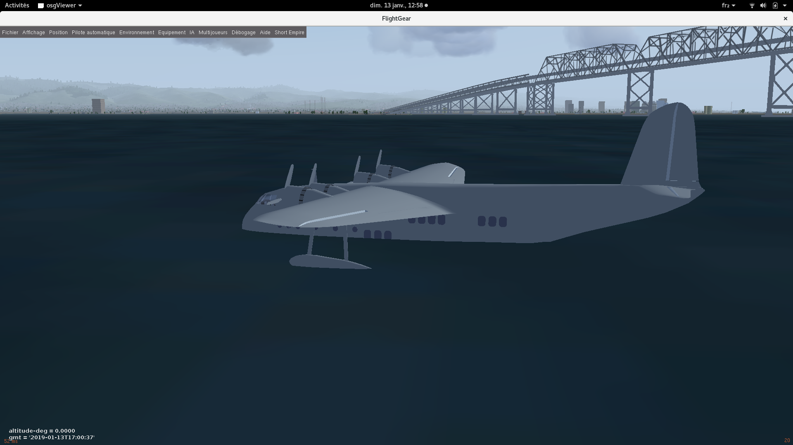
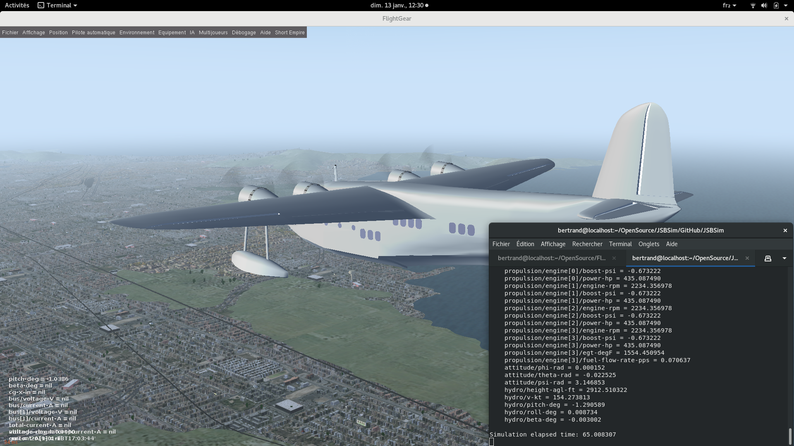

|Build| Travis CI (Linux) | AppVeyor CI (Windows) |
|:-:|:-----------------:|:---------------------:|
|| [](https://travis-ci.org/JSBSim-Team/jsbsim) | [](https://ci.appveyor.com/project/agodemar/jsbsim/branch/master) |

<p align="center">

</p>

**[User Guide](#user-guide)**               |
**[Developer Docs](doc/DevelopersDocs.md)** |
**[FAQ](#frequently-asked-questions)**      |
**[Contact](#contact)**                     |
**[Legal notice](#legal-notice)**
---

# Introduction
JSBSim is a multi-platform, general purpose object-oriented Flight Dynamics Model (FDM) written in C++. The FDM is essentially the physics & math model that defines the movement of an aircraft, rocket, etc., under the forces and moments applied to it using the various control mechanisms and from the forces of nature. JSBSim can be run in a standalone batch mode flight simulator (no graphical displays) for testing and study, or integrated with [FlightGear](https://www.flightgear.org/) or other flight simulator.
 
Features include:

* Nonlinear 6 DoF (Degree of Freedom)
* Fully configurable flight control system, aerodynamics, propulsion, landing gear arrangement, etc. through XML-based text file format.
* Rotational earth effects on the equations of motion (Coriolis and centrifugal acceleration modeled).
* The earth atmosphere is modeled according to the [International Standard Atmosphere (1976)](https://ntrs.nasa.gov/archive/nasa/casi.ntrs.nasa.gov/19770009539.pdf)
* Configurable data output formats to screen, file, socket, or any combination of those.
* A [Python](https://www.python.org) module which provides the exact same features than the C++ library

More information on JSBSim can be found at the JSBSim home page here:

http://www.jsbsim.org

# User Guide
**[Installation](#installation)** |
**[Quick Start](#quick-start)**   |
**[User Docs](#user-documentation)** |
**[Interfacing JSBSim with your app](#interfacing-jsbsim-with-your-application)**
---
## Installation
### Windows
Win64 executables for JSBSim are available in the [JSBSim project release section](https://github.com/JSBSim-Team/jsbsim/releases). There are 2 executables:
* `JSBSim.exe` which runs FDM simulations.
* `aeromatic.exe` which builds aircraft definitions from Question/Answer interface

Both executables should be used from the console.
### Ubuntu Linux
Debian packages for Ubuntu Linux "Xenial" 16.04 LTS on 64 bits platform are also available in the [JSBSim project release section](https://github.com/JSBSim-Team/jsbsim/releases). There are 3 packages:
* `JSBSim_1.0.0-xxx.xenial.amd64.deb` which installs the executables `JSBSim` and `aeromatic`
* `JSBSim-devel_1.0.0-xxx.xenial.amd64.deb` which installs the development resources (headers and libraries)
* `python3-JSBSim_1.0.0-xxx.xenial.amd64.deb` which installs the Python 3.6 module of JSBSim
### Python module
JSBSim provides binary packages (a.k.a. known as [wheel packages](https://www.python.org/dev/peps/pep-0427)) for its Python module on Windows and Linux platforms for several Python versions (3.5, 3.6, 3.7 and 3.8).

The module is installed with the `pip` command line (check the [pip documentation](https://packaging.python.org/tutorials/installing-packages) for more details):
```bash
> pip install jsbsim --no-index -f https://github.com/JSBSim-Team/jsbsim/releases/download/Rolling-release-v2019/JSBSim-1.1.0.dev1-cp37-cp37m-manylinux1_x86_64.whl
```
The example above downloads and installs JSBSim for Python 3.7 on a Linux platform directly from the JSBSim GitHub project page. The package corresponding to your platform and Python version must be picked among all the available JSBSim wheel packages that are listed in the [Releases page](https://github.com/JSBSim-Team/jsbsim/releases/tag/Rolling-release-v2019).

Note that wheel packages for Linux meet the [ManyLinux packages requirements](https://www.python.org/dev/peps/pep-0513) and as such are compatible with all the major Linux distributions.
### Other platforms
At the moment, JSBSim do not provide binaries for platforms other than Windows 64 bits and Ubuntu 16.04 64 bits. If you fall in this category you should follow the instructions in the [developer docs](doc/DevelopersDocs.md) to build JSBSim on your platform.
### Aircraft data and example scripts
You can get aircraft data and example scripts by downloading either the [zip package](https://github.com/JSBSim-Team/jsbsim/archive/Release_Candidate_v1.0.0.zip) or the [tar.gz package](https://github.com/JSBSim-Team/jsbsim/archive/Release_Candidate_v1.0.0.tar.gz).
## Quick start
Once you have downloaded (or built) the binaries and unzipped the [aircraft data](#aircraft-data-and-example-scripts). Go to the root of the data package and make sure the executable is accessible from there.

You can then run an FDM simulation with the following command:
```bash
> JSBSim.exe --script=scripts/c1721.xml
```

More options are available if you run:
```bash
> JSBSim.exe --help
```
## User documentation
A first place to look at for JSBSim documentation resources is [http://jsbsim.sourceforge.net/documentation.html](http://jsbsim.sourceforge.net/documentation.html). This link points to the official [JSBSim Reference Manual](http://jsbsim.sourceforge.net/JSBSimReferenceManual.pdf), a PDF which is the best source of information for users and developers.

However, due to the nature of the development of the project (JSBSim sources are updated often, sometimes even daily), several new features that are available in the software are not yet documented in the reference manual. Starting from March 2018 a new effort is underway to deliver an up-to-date documentation web site. You can browse the new *JSBSim Online Reference Manual* by going to: [https://jsbsim-team.github.io/jsbsim-reference-manual](https://jsbsim-team.github.io/jsbsim-reference-manual). The online manual is under construction and as a first milestone it will incorporate all the non-outdated material contained in the original PDF Reference Manual. The online manual web site is based on the GitHub Pages technology and its sources are available [here](https://github.com/JSBSim-Team/jsbsim-reference-manual). Eventually, the PDF Reference Manual will be superseded by the online manual, which is designed to be updated collaboratively as well as in efficient and timely fashion.

## Interfacing JSBSim with your application
### Using the C++ API
JSBSim can be interfaced or integrated to your application via a C++ API. The  following  code  illustrates  how  JSBSim  could  be  called  by  a  small  program, with execution being controlled by a script: 
```c++
#include <FGFDMExec.h>

int main(int argc, char **argv)
{
  JSBSim::FGFDMExec FDMExec;
  FDMExec.LoadScript(argv[1]);
  FDMExec.RunIC();
  bool result = true;
  while (result) result = FDMExec.Run();
}
 ```
The API is described in more details in the [C++ API documentation](doc/DevelopersDocs.md#c-api-documentation)

### Using the Python module
JSBSim can also be used as a Python module. The following code provides a simple example of how to interface with JSBSim using the Python programming language:
```python
import jsbsim

fdm = jsbsim.FGFDMExec('.', None)
fdm.load_script('scripts/c1721.xml')
fdm.run_ic()

while fdm.run():
  pass
```
A more elaborate example is [JSBSim.py](https://github.com/JSBSim-Team/jsbsim/blob/master/python/JSBSim.py), the Python version of `JSBSim.exe`.

# Frequently Asked Questions

### How can I interface JSBSim with FlightGear ?
**Q:** I would like to visualize the aircraft model in [FlightGear](http://flightgear.org) while running the FDM with the JSBSim executable. How do I proceed ?

**A:** We are assuming that FlightGear is installed on your platform. If it is not, please follow the instructions on the [FlightGear website](http://home.flightgear.org/download/main-program).

You will need to launch separately FlightGear and JSBSim from a console. In the example below, you will execute the script [ShortS23_2.xml](scripts/Short_S23_2.xml) so you might need to install the [Short Empire aircraft](http://wiki.flightgear.org/Short_Empire). This is optional however and any aircraft can be used for visualization even if it does not correspond to the FDM.

First, run FlightGear and tell it that the flight dynamics will be provided thru a socket by an external program. It is assumed that the executable of FlightGear is `fgfs` (see the FlightGear docs for [details on the parameters of `--native-fdm`](http://wiki.flightgear.org/Property_Tree/Sockets#Native_Socket) argument).
```bash
> fgfs --fdm=null --native-fdm=socket,in,60,,5550,udp --aircraft=Short_Empire --airport=SP01
```
Once FlightGear is launched, you will see the aircraft standing still.



Now we will run JSBSim and tell it that it must send the flight dynamics data to a socket with the FlightGear protocol
```bash
> JSBSim scripts/Short_S23_2.xml data_output/flightgear.xml --realtime --nice
```
The parameters describing the protocol are detailed in [`data_output/flightgear.xml`](data_output/flightgear.xml). The flag `--realtime` requests JSBSim to execute in real time. Otherwise JSBSim will run as fast as it can and the flight will look like it is played fast forward. The flag `--nice` tells JSBSim to use as few CPU power as possible. This is an optional flag but since we requested `--realtime`, JSBSim will spend a considerable amount of time idling, waiting for the next time step.

At the this stage, the two executables are interacting and FlightGear produces the visualization of the flight dynamics simulated by JSBSim.



# Contact
For more information on JSBSim, you can contact the development team on the mailing list jsbsim-devel@lists.sourceforge.net or submit tickets on https://github.com/JSBSim-Team/jsbsim/issues

We are also on Facebook: https://www.facebook.com/jsbsim/

# Legal Notice
JSBSim is open source and is licensed under the LGPL 2.1 license. The license is included in the source code in the file [COPYING](https://github.com/JSBSim-Team/jsbsim/blob/master/COPYING)

No proprietary code is included. All code included within JSBSim has been developed on a volunteer basis using publicly available information, and is often directly linked to a particular textbook, for educational reference. In some cases, code of a generic nature has been donated back to the project.

Likewise, the aircraft models included in this project and distribution do not include any proprietary, sensitive, or classified data. All data is derived from textbooks (such as Stevens and Lewis "Aircraft Control and Simulation" and Sutton's "Rocket Propulsion Elements"), freely available technical reports (see: http://ntrs.nasa.gov and http://www.aiaa.org), or other public data (such as the FAA web site). Aircraft models included in the JSBSim distribution and with names corresponding to existing commercial or military aircraft are approximations crafted using publicly available information, and are for educational or entertainment uses only. 
