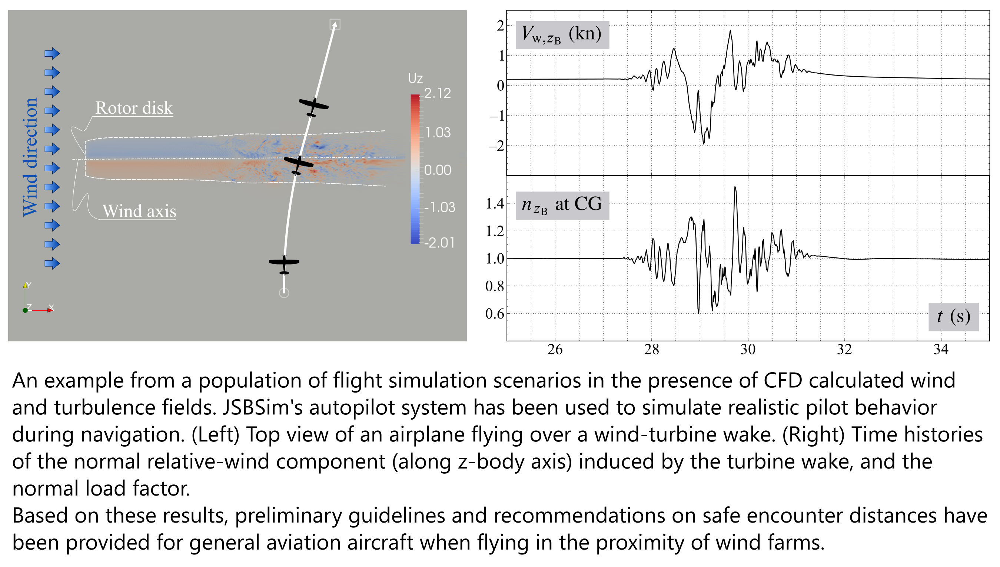

# Summary

JSBSim is an open-source, platform-independent, data-driven flight dynamics software library for aerospace research, simulation development, and education. It provides high-fidelity modeling of aerospace vehicle dynamics, and includes propulsion, control systems, aerodynamics, and other subsystem models, as well as environmental models such as atmosphere, gravity, and geodesy.

JSBSim can be invoked from the command line — running faster than real time for scripted flight scenarios, Monte Carlo studies, or AI training — or it can be integrated into an interactive simulator codebase such as FlightGear, Unreal Engine, or Outerra and run in real time.

Features include:

* Rigid body dynamics with support for 6-degrees-of-freedom (6-DoF) simulations.
* Quaternion-based computation of the aircraft attitude to avoid the gimbal lock of Euler angles.
* Accurate environment models (geodesy, atmosphere, rotational planet effects).
* Fully configurable input model characteristics and output logging.
* Developed in standard-compliant C++17, with bindings for Python, and MATLAB (includes a Simulink S-Function).

JSBSim has been in active development for almost 30 years.

# Statement of Need

JSBSim emerged from the need for an open, modern, clean, extensible flight dynamics model (FDM). Aerospace researchers, instructors, and engineers often need an FDM that is scientifically credible and openly accessible. Existing FDMs are either proprietary, tightly integrated with specific simulators, or lack extensibility for custom modeling, automated testing, or integration into research pipelines. Others have been in development for so long that they have become difficult to adapt or even to understand. JSBSim fills this gap by offering a standalone, open-source FDM with a clear architecture, straightforward and predictable behavior, and a long history in academic, government, and open-source projects.

The JSBSim XML-based model definitions support validation, and scriptable running supports testing and reproducibility.

# State of the Field

In the research community, several tools are currently used to model flight dynamics, but they are often unavailable for public use or present significant limitations for automated research or high-fidelity academic studies. The [Trick simulation environment](https://github.com/nasa/trick), developed at NASA Johnson Space Center, was released as open source software in 2015. [POST2](https://www.nasa.gov/post2/) — successor to POST, Program to Optimize Simulated Trajectories, developed over 50 years ago — is still used internally within NASA to this day, as a trusted and well-verified tool.
Within the open-source and free-to-use landscape, [YASim](https://wiki.flightgear.org/YASim) (also used in [FlightGear](https://www.flightgear.org)) offers a quick-solving approach where the FDM is automatically generated from geometry and performance points using Blade Element Theory. While efficient for rapid prototyping, it generates plausible but low-fidelity models.
[X-Plane](https://www.x-plane.com/) also uses a fast, low-fidelity aerodynamic model, but it cannot run natively in a headless mode. Its closed-source nature makes it difficult to extend or integrate deeply into custom research pipelines without complex, third-party interfaces.
Engineering-focused tools like the [MATLAB Aerospace Toolbox](https://www.mathworks.com/products/aerospace-toolbox.html) provide high-fidelity components but are proprietary and require the MATLAB/Simulink ecosystem.

# Unique Scholarly Contribution

JSBSim’s unique contribution lies in providing a standalone traditional coefficient-based, “architecture-light,” FDM that bridges the gap between the alternatives mentioned above. Unlike YASim and X-Plane, JSBSim primarily uses stability derivatives to model vehicle aerodynamics. Stability derivatives can be constant or functionally dependent on other state and input variables. However, the use of stability derivatives is not the only option available to FDM authors. The XML-based metalanguage provided by JSBSim allows for the use of general, nonlinear, and multidimensional lookup tables to model any type of behavior within the FDM.

By providing a complete, turnkey solution, JSBSim allows researchers to bypass the complexity of building a simulation engine from scratch and focus entirely on their specific area of study. Furthermore, for research topics that require modeling beyond the standard stability derivative approach, JSBSim’s `external_reactions` feature offers the flexibility to interface with any external aerodynamic or propulsive simulation (or co-simulation) method, ensuring the library remains extensible for even the most unconventional aerospace designs.

# Software Design

JSBSim was designed from the ground up with several features in mind [@Berndt:2004:JSBSim]. One was to make the codebase easily comprehensible and expandable, and another was to completely separate the characteristics of a specific vehicle from a completely generic codebase. This was done in part to keep possibly proprietary information out of the codebase. With all specific model characteristics contained in data files, there is no need to recompile the code to model a different vehicle, or changes to the vehicle characteristics. This is a key design feature of JSBSim, which allows users to define an entire FDM using XML files — unlike, for example, [LaRCSim](https://ntrs.nasa.gov/citations/19950023906), where modifying aircraft parameters requires writing and re-compiling C code.

JSBSim scales to highly complex aerospace vehicles — even rockets with GNC systems and large aerodynamic databases derived from wind tunnel testing — all specified through data files alone. In fact, the input metalanguage offers great flexibility in terms of defining properties within a specific FDM, with the availability of a large number of mathematical operators, interpolating functions from data arranged in tabular form, and access to the aircraft's metrics and state via the property system.
In the example of \autoref{fig:Cm_delta:e}, the pitch moment due to elevator (linearly dependent on its deflection $\delta_{\mathrm{e}}$) is defined in terms of a control power coefficient $C_{m_{\delta_\mathrm{e}}}$, which is a function of Mach number $M_{\infty}$.

The more common execution from the command line involves running from a script, which interacts with the simulation by modifying properties based on conditional logic. While JSBSim handles the continuous physics of flight, the script acts as a state-machine-driven mission controller, providing the discrete logical transitions required to navigate complex flight scenarios. JSBSim scripts are coded as XML-based input files, with their specific metalanguage.

# A Selected Example of Use in Research: Flight Load Assessment for Light Aircraft Flying near Wind Turbine Wake

JSBSim has been used by @Varriale:DeMarco:2018:Flight:Load:Assessment to assess the flight loads on light aircraft flying through or nearby wind turbine wakes. For this research JSBSim's autopilot system has been used to simulate realistic pilot behavior during navigation, see \autoref{fig:wake:crossing}.

# Implementation and Engineering Practices

A key requirement of an FDM is accuracy. The JSBSim equations of motion were verified through comparison with other similar flight simulation applications. The [NASA Engineering Safety Center](https://www.nasa.gov/nesc) undertook an effort in 2015 to develop a set of check cases that could serve as a basis for comparing time-history data across simulations. JSBSim was included in this effort as the only non-NASA simulation software [@Murri:2015:Check:Cases].

The library also leverages the broader open-source ecosystem by integrating mature and specialized components. For XML parsing, JSBSim relies on [Expat](https://libexpat.github.io/), a foundational and industry-standard library in the open-source community. Additionally, complex geodesic calculations required for high-fidelity trajectory modeling on the WGS84 oblate spheroid are performed using Charles Karney’s [GeographicLib](https://geographiclib.sourceforge.io/), ensuring precision in geospatial positioning and navigation [@Karney:2025:GeographicLib].

JSBSim adheres to modern open-source Quality Assurance standards through an extensive Continuous Integration and Continuous Deployment.

# Research Impact Statement

JSBSim is used across a broad range of aerospace applications, including flight control development, UAV research, aircraft design studies, and simulation-based testing. Its use in academic and industry research has resulted in over 1000 citations as per Google Scholar, and it has been integrated into several popular flight simulators and research platforms. In the existing scientific literature, the key works on JSBSim are those by @Berndt:2004:JSBSim, @DeMarco:2007:General:Solution:Trim, @Berndt:DeMarco:2009:Progress:JSBSim, @Murri:2015:Check:Cases.

Examples of use cases include:

- Modeling flight dynamics within a full-featured flight simulator, such as [FlightGear](https://www.flightgear.org), [MIXR (Mixed Reality Simulation Platform)](https://www.mixr.dev) (formerly known as OpenEaagles), the [Outerra world simulator](https://outerra.com), or [Epic Games' Unreal Engine 5](https://www.unrealengine.com/unreal-engine-5).

- Control system design. See the articles by @Vogeltanz:2018:Development:Control:System:Designer and @Vogeltanz:2020:Control:System:Designer.

- Reinforcement learning research, where JSBSim is used as the environment in which an agent learns to control an aircraft. One example being its use in the [DARPA Virtual Air Combat Competition](https://www.darpa.mil/news/2019/virtual-air-combat-competition). See also the works by @DeMarco:2023:DRL:Hight:Performance:Aircraft, @Pope:2023:Hierarchical:RL:DARPA:Trials, @Chen:2026:Physics:Informed:Target:Aiming.

- SITL (Software In The Loop) Drone autopilot testing: [ArduPilot](https://ardupilot.org/dev/docs/sitl-with-jsbsim.html), [PX4 Autopilot](https://docs.px4.io/main/en/sim_jsbsim/), [Paparazzi](https://wiki.paparazziuav.org/wiki/Simulation).

- UAV modeling. See @Kamal:2016:Modeling:Flight:Simulation:UAV, @Cereceda:2019:Giant:BigStik.

- Rocket trajectory simulations. See @Gomez:2003:Active:Guidance, @Braun:2006:Design:ARES, @Kenney:2011:Flight:Simulation:ARES.

- Sensor assessment and Human Factor. See @Zhang:2010:Mathematical:Models:Pilot, @McAnanama:2018:OpenSource:FDM:IMU.

- Simulation integration. See @Park:2008:Experimental:Evaluation:UAV:TMO, @Nicolosi:DeMarco:2018:Roll:Performance:Assessment, @Saber:2025:Integration:JSBSim:Unreal.

- CPU performance benchmarking. JSBSim has been included in the [SPEC CPU 2026](https://www.spec.org/cpu2026/) [@Madhav:2026:SPEC:CPU:Next:Generation], a widely recognized benchmark suite designed to measure the performance of a computer's processor, memory, and compiler efficiency using compute-intensive workloads.

JSBSim’s versatility is further expanded by its blossoming Python ecosystem, which has seen over one million cumulative downloads across PyPI and Conda. While its established C++ integration remains fundamental, there is a significant growth in users leveraging Python’s ubiquity in the research, engineering, and AI communities. This trend is reflected in a growing number of applications that utilize interactive notebooks to provide a didactic interface, effectively lowering the barrier to entry. Moreover, Python enables a more dynamic approach to simulation, allowing users to complement traditional XML scripting with complex programmatic scenarios and to develop sophisticated aerodynamic or propulsion models. A great potential of the JSBSim Python API is confirmed, for instance, by its straightforward usability within applications based on [PathSim](https://pathsim.org/) [@Rother:2025:PathSim:JOSS] and its companion [PathView](https://view.pathsim.org/); the latter being a Python native environment with a visual toolbox capable of modeling simulation workflows, as noncommercial alternative to MATLAB/Simulink or Modelica.

# Acknowledgements

JSBSim is currently being maintained and developed by the authors. Initial architecture and development was done by Jon S. Berndt (JSB), with major contributions from Tony Peden, David Megginson, David Culp, and Curt Olson.

# AI Usage Disclosure 

This manuscript was prepared also with support of AI‑based tools, basically to enhance clarity and refine language. The authors remain fully responsible for the content of the manuscript.
In terms of coding, data generation and scientific claims — due to the fact that JSBSim largely predates the advent of AI — most of the software development has been made by humans and all the contributions are reviewed by humans.
 
# References
