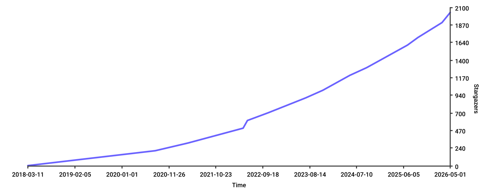

# Summary

JSBSim is an open-source, platform-independent, data-driven flight dynamics software library for aerospace research, simulation development, and education. It provides a high-fidelity, fully scriptable environment for modeling aircraft dynamics, propulsion, control systems, and flight conditions.

JSBSim can be used in batch mode running faster than real-time for flight analysis or AI training or run within a flight simulator environment like FlightGear in real-time.

Features include:

- Rigid body dynamics with support for 6-degrees-of-freedom (6-DoF) simulations.
- Quaternion-based compution of the aircraft attitude to avoid the gimbal lock of Euler angles.
- Fully configurable aerodynamics, flight control system, propulsion, landing gear arrangement, etc. through XML-based text file format.
- Accurate Earth model including:
   - Rotational effects on the equations of motion (Coriolis and centrifugal acceleration modeled).
   - Oblate spherical shape and geodetic coordinates according to the WGS84 geodetic system.
   - Atmosphere modeled according to the International Standard Atmosphere (1976).
- Configurable data output formats to screen, file, socket, or any combination of those.

Developed in standard-compliant C++17, JSBSim also includes the following bindings and interfaces:

- Python module (compatible with Python 3.10+).
- MATLAB S-Function that interfaces JSBSim with MATLAB Simulink.
- Unreal Engine plugin.

# Statement of Need

Aerospace researchers, instructors, and engineers often need a flight dynamics model (FDM) that is scientifically credible and openly accessible. Existing FDMs are either  proprietary, tightly integrated with specific simulators, or lack extensibility for custom modeling, automated testing, or integration into research pipelines. Others have been in development for so long that they have become difficult to adapt or even to understand. JSBSim fills this gap by offering a standalone, open-source FDM with a clear architecture, straightforward and predictable behavior, and a long history in academic, government, and open-source projects.

The JSBSim XML-based model definitions support validation, and scriptable running supports reproducibility.

# Early Motivation

While electro-mechanical flight *trainers* (such as Link’s Blue Box) have been around for almost 100 years, flight simulation codebases have been around since the mid-70s, beginning with Bruce Artwick’s first foray into computer-based flight simulation, as part of his engineering thesis - fifty years ago! Some of the earliest codebases were written in Fortran and evolved over the years into very capable and trusted tools. However, over the years, additions to those codebases by various contributors resulted in code that was less cohesive, brittle, and hard to read.

The C++ programming language emerged in the mid-1980’s and began to see widespread use due in part to its support for object-oriented design concepts. In the mid-1990’s after having worked for ten years on flight simulation tasks involving older, hard to read and use legacy code, the original JSBSim developer thought, “there’s got to be a better way,” and began experimenting with flight simulation code in C++, which seemed to be a very well-suited language for flight simulation.

Almost 30 years later, and with the participation of many contributors and collaborators, JSBSim is a great example of what the Open Source paradigm can achieve.

# Development and Design Choices

JSBSim was designed from the ground up with several features in mind. One was to make the codebase easily comprehensible and expandable, and another was to completely separate the characteristics of a specific vehicle from a completely generic codebase. This was done in part to keep possibly proprietary information out of the codebase [@Berndt:2004:JSBSim].

In a nutshell, the flow of the code can be illustrated as follows:

[diagram or explanation of the architecture of the code and how it is instantiated]

JSBSim is data-driven, with all specific model characteristics contained in data files, therefore there is no need to recompile the code to model a different vehicle, or changes to the vehicle characteristics.

This is a key design feature of JSBSim, which allows users to define an entire FDM model using XML files—unlike, for example, [LaRCSim](https://ntrs.nasa.gov/citations/19950023906), a similar generic flight simulation library developed by NASA, where modifying aircraft parameters required writing and re-compiling C code.

Furthermore, JSBSim's low computational footprint allows it to run on virtually any personal computer. The reliance on XML for configuration and CSV for output enables a lightweight development workflow. Users can create and refine complex FDMs using any basic text editor and process simulation results with ubiquitous tools such as Microsoft Excel or Gnuplot. This approach eliminates the need for specialized development environments.

## JSBSim FDM Definition

A brief introduction to the various XML based components that make up a JSBSim FDM.

The FDM is defined in one or more XML files which define the mass configuration, ground reactions for the gear, propulsion, the flight control system and the forces and moments for the 6 axes.

### Mass

The `mass_balance` element is used to define the aircraft’s empty weight, the center of gravity at empty weight and the moments of inertia at empty weight.

```xml
<mass_balance negated_crossproduct_inertia="true">
    <ixx unit="SLUG*FT2"> 562000 </ixx>
    <iyy unit="SLUG*FT2"> 1.473e+06 </iyy>
    <izz unit="SLUG*FT2"> 1.894e+06 </izz>
    <ixy unit="SLUG*FT2"> 0 </ixy>
    <ixz unit="SLUG*FT2"> 8000 </ixz>
    <iyz unit="SLUG*FT2"> 0 </iyz>
    <emptywt unit="LBS"> 83000 </emptywt>
    <location name="CG" unit="IN">
        <x> 639 </x>
        <y> 0 </y>
        <z> -40 </z>
    </location>
</mass_balance>
```

Additional mass can be added via `tank` and `pointmass` elements.

During each simulation timestep JSBSim sums up the current mass of each of the tank elements taking into account any mass loss due to engine fuel burn plus the mass of the set of `pointmass` elements. In addition to calculating the current total mass of the aircraft, the center of gravity is also updated based on the physical location of the various masses and lastly the moments of inertia are also updated.

### Ground Reactions

The `contact` element is used to define either landing gear contacts or structural contacts. JSBSim uses their location, friction coefficients, spring and damping coefficients in order to calculate the forces and moments from their interaction with the ground.

Landing gear contacts (`BOGEY`) also define additional properties in terms of whether they can be used for steering, whether they include brakes and whether they’re retractable.

```xml
<contact name="Left Main Gear" type="BOGEY">
    <location unit="IN">
        <x>  648 </x>
        <y> -100 </y>
        <z>  -84 </z>
    </location>
    <static_friction> 0.80 </static_friction>
    <dynamic_friction> 0.50 </dynamic_friction>
    <rolling_friction> 0.02 </rolling_friction>
    <spring_coeff unit="LBS/FT"> 120000 </spring_coeff>
    <damping_coeff unit="LBS/FT/SEC"> 10000 </damping_coeff>
    <damping_coeff_rebound unit="LBS/FT/SEC"> 20000 </damping_coeff_rebound>
    <max_steer unit="DEG"> 0.0 </max_steer>
    <brake_group> LEFT </brake_group>
    <retractable> 1 </retractable>
</contact>
```

A `STRUCTURE` contact can be defined for example to provide a contact point at the rear of the fuselage for performing a velocity minimum unstick $V_{MU}$ simulation flight test.

A fundamental physical distinction between the two is the direction of the reaction force. For `BOGEY` elements, the force is oriented along the gear's mechanical axis (defined by its orientation), allowing for accurate modeling of strut compression. In contrast, `STRUCTURE` elements represent airframe parts where the reaction force is always normal to the ground surface. `BOGEY` contacts also support specialized features such as steering, braking, and retraction, as shown in the example above.

The calculation of friction forces in JSBSim is an adaptation of the algorithm described in Erin Catto's paper 'Iterative Dynamics with Temporal Coherence'. The implementation relies on a projected Gauss-Seidel algorithm to handle the inequalities induced by the Coulomb friction law, providing a robust solution for multi-point ground contacts.

### Aerodynamic Force and Moments

All aerodynamic forces and moments have to be specified within the FDM. JSBSim itself doesn’t define any forces or moments. The forces and moments can be specified in one of 3 reference frames, the body axes, stability axes or the wind axes.

The author of the FDM is free to define as many or as few forces and moments based on the level of fidelity they want to implement and based on the aerodynamic data that they have available to them for the aircraft type.

JSBSim provides a number of mathematical functions for use in calculating a force or moment. A lookup table element is also provided.

```xml
<function name="aero/Lift_alpha">
    <description>Lift due to alpha</description>
    <product>
        <property>aero/qbar-psf</property>
        <property>metrics/Sw-sqft</property>
        <table> <!-- CLalpha coefficient lookup table, 1D tabular function -->
            <independentVar>aero/alpha-rad</independentVar>
            <tableData>
               -0.20 -0.68
                0.00  0.20
                0.23  1.20
                0.46  0.20
            </tableData>
        </table>
    </product>
</function>
```

JSBSim provides a number of pre-calculated properties, e.g. `aero/qbar-psf` is the dynamic pressure $\frac{1}{2} \rho V^2$ calculated based on the current air density of the aircraft within the atmosphere model and the aircraft’s true airspeed.

The property system used by JSBSim, which is essentially the same as the one used by [FlightGear](https://www.flightgear.org), is a highly versatile way to create and access data using a hierarchical structure. This hierarchy organizes parameters into logical groups, as seen in the examples above: aerodynamic properties are grouped under the `aero/` prefix (e.g., `aero/qbar-psf`, `aero/alpha-rad` for angle of attack, or `aero/beta-rad` for sideslip angle), while geometric parameters are stored under `metrics/` (e.g., `metrics/Sw-sqft` for wing area or `metrics/cbarw-ft` for mean aerodynamic chord). This structured approach ensures data organization and promotes naming consistency across different aircraft models.

During each time step JSBSim evaluates each function defining a force for each axis and sums all the forces in order to calculate the net force per axis.

The Moment Reference Center (MRC), defined by the `AERORP` element within the `metrics` section, is the reference point around which all aerodynamic moments are calculated. This point is crucial as it defines the pivot for the aircraft's aerodynamic stability and control moments before they are translated to the center of gravity.

```xml
<metrics>
    <location name="AERORP" unit="IN">
        <x> 625 </x>
        <y> 0 </y>
        <z> 24 </z>
    </location>
</metrics>
```

The moments and forces can also reference properties that define control positions, e.g. `fcs/elevator-pos-rad` as shown below. The next XML snippet is also an example of how Mach effects may be modelled. In this case the control power $C_{m_{\delta_e}}$ is defined as a simple 1D tabular function of the instantaneous Mach number (`velocities/mach`):

```xml
<function name="aero/PitchMoment_elevator">
    <description>Pitch moment due to elevator</description>
    <product>
        <property>aero/qbar-psf</property>
        <property>metrics/Sw-sqft</property>
        <property>metrics/cbarw-ft</property>
        <property>fcs/elevator-pos-rad</property>
        <table> <!-- 1D tabular function -->
            <independentVar>velocities/mach</independentVar>
            <tableData> <!-- lookup table - Cmde coefficient -->
                0.0 -1.20
                2.0 -0.30
            </tableData>
        </table>
    </product>
</function>
```

All the moment definitions are evaluated and summed for each axis. JSBSim then calculates an additional moment based on the current forces and the moment arm between the current cg and the MRC.

A quite unique feature of the FDM is that users can also define *custom functions* in their XML configuration files. The functions may access to the whole set of properties exposed by the model, which can be variables and updated at runtime, and define themselves new variables. This enables all kind of special behaviors and interconnections between subsystem and allows to confine the specific model's peculiarities in the input files rather than cluttering the code.

### Propulsion

JSBSim includes engine models covering piston, turbine, turboprop, rocket and electric engines. Configuration parameters are defined to specify the performance of specific engines.

A `propulsion` element is defined which specifies an engine file for the specific engine, it’s physical location and orientation on the aircraft.

```xml
<propulsion>
    <engine file="CFM56">
        <feed>0</feed>
        <feed>2</feed>
        <thruster file="direct">
            <location unit="IN">
                <x> 540 </x>
                <y> -193 </y>
                <z> -40 </z>
            </location>
            <orient unit="DEG">
                <roll> 0 </roll>
                <pitch> 0 </pitch>
                <yaw> 0 </yaw>
            </orient>
        </thruster>
    </engine>
</propulsion>
```

Below is an example of a specific turbine engine type.

```xml
<turbine_engine name="CFM56">
  <milthrust> 20000.0 </milthrust>
  <bypassratio>     5.9 </bypassratio>
  <tsfc>            0.657 </tsfc>
  <bleed>           0.04 </bleed>
  <idlen1>         30.0 </idlen1>
  <idlen2>         60.0 </idlen2>
  <maxn1>         100.0 </maxn1>
  <maxn2>         100.0 </maxn2>

  <function name="MilThrust">
    <table> <!-- 2D tabular function -->
      <independentVar lookup="row">velocities/mach</independentVar>
      <independentVar lookup="column">atmosphere/density-altitude</independentVar>
      <tableData> <!-- lookup table -->
                  -10000  0       10000   20000   30000   40000   50000   60000
            0.0   1.2600  1.0000  0.7400  0.5340  0.3720  0.2410  0.1490  0.0
            0.2   1.1710  0.9340  0.6970  0.5060  0.3550  0.2310  0.1430  0.0
            0.4   1.1500  0.9210  0.6920  0.5060  0.3570  0.2330  0.1450  0.0
            0.6   1.1810  0.9510  0.7210  0.5320  0.3780  0.2480  0.1540  0.0
            0.8   1.2580  1.0200  0.7820  0.5820  0.4170  0.2750  0.1700  0.0
            1.0   1.3690  1.1200  0.8710  0.6510  0.4750  0.3150  0.1950  0.0
            1.2   0.0000  0.0000  0.0000  0.0000  0.0000  0.0000  0.0000  0.0
      </tableData>
    </table>
  </function>
</turbine_engine>
```

If JSBSim's specific engine modelling doesn’t meet the FDM author's requirements a propulsion force can be added as an `external_reaction` with the FDM author calculating the magnitude of the force which JSBSim will then apply.

### FCS

The Flight Control System can be as simple as modelling a direct physical connection mapping the pilot’s control input in the range from `[-1, +1]` linearly to an angular position for the relevant control position. Or a complete Fly-By-Wire (FBW) FCS can be implemented.

The control position property is then used by functions in the aerodynamic section for calculating forces and moments.

```xml
<channel name="Pitch">

    <summer name="Pitch Trim Sum">
        <input>fcs/elevator-cmd-norm</input>
        <input>fcs/pitch-trim-cmd-norm</input>
        <clipto>
            <min>-1</min>
            <max> 1 </max>
        </clipto>
    </summer>

    <aerosurface_scale name="Elevator Control">
        <input>fcs/pitch-trim-sum</input>
        <range>
            <min> -0.3 </min>
            <max>  0.3 </max>
        </range>
        <output>fcs/elevator-pos-rad</output>
    </aerosurface_scale>
```

The JSBSim FCS is capable of modeling a wide variety of control laws, ranging from simple open-loop systems to sophisticated closed-loop architectures. This is achieved through a comprehensive set of components, including filters, summers, switches, and `pid` elements for feedback control.

### Initialization

In the `ball.xml` example, the user must also specify to JSBSim, at time zero and relative to a reference frame fixed to Earth, the position of the center of mass, its velocity vector, as well as the solid’s orientation and angular velocity. This information is contained in the `reset00_v2.xml` file, a simplified version of which is shown below:

```xml
<?xml version="1.0"?>
<initialize name="reset00" version="2.0">

  <!-- This file sets up the spacecraft to start off
       at altitude and orbital velocity. -->

  <position frame="ECEF">
    <altitudeMSL unit="FT"> 800000.0  </altitudeMSL>
  </position>

  <orientation unit="DEG" frame="LOCAL">
    <yaw>   90.0  </yaw>
  </orientation>

  <velocity unit="FT/SEC" frame="BODY">
    <x> 23889.146 </x>
  </velocity>

  <attitude_rate unit="DEG/SEC" frame="ECI">
    <x> 0.0 </x>
    <y> 0.0 </y>
    <z> 0.0 </z>
  </attitude_rate>

</initialize>
```

And here is how we invoke the batch version of JSBSim from the command line, which reads the above inputs:

```sh
./JSBSim --end=5400 --aircraft=minimal_ball --initfile=reset00_v2
```

Running the above command results in the ball characteristics being read in, placed at the state specified in the `reset00_v2.xml` file, and running for 5400 seconds. The position of the ball is logged at 1 Hz in a file named `BallOut.csv`.

## JSBSim Scripting

JSBSim provides an XML based scripting facility which allows the user to reproduce the same starting conditions and inputs while for example comparing the output as some aerodynamic coefficients are changed to see the effect they have on the aircraft's response.

Here is a simple example which specifies a specific aircraft model and initial conditions, then instructs JSBSim to trim the aircraft at these initial conditions, and finally input an elevator doublet, and run the test for 20s. Relevant parameters like pitch attitude, angle of attack etc. can be logged and then used for example to calculate the aircraft's short period response.

```xml
<?xml version="1.0" encoding="utf-8"?>
<?xml-stylesheet type="text/xsl" href="http://jsbsim.sf.net/JSBSimScript.xsl"?>
<runscript xmlns:xsi="http://www.w3.org/2001/XMLSchema-instance"
    xsi:noNamespaceSchemaLocation="http://jsbsim.sf.net/JSBSimScript.xsd"
    name="Elevator doublet test">

  <description>
    Trim the aircraft and then input an elevator doublet.
  </description>

  <use aircraft="737" initialize="elevator_doublet_init"/>

  <run start="0" end="20" dt="0.008333">
    <event name="Start Trim">
      <condition> simulation/sim-time-sec ge 0 </condition>
      <set name="simulation/do_simple_trim" value="1"/>  <!-- 1 - Full trim -->
    </event>

    <event name="StartDoublet">
      <condition> simulation/sim-time-sec ge 1.0 </condition>
      <set name="fcs/elevator-cmd-norm" value="-0.2" />
    </event>

    <event name="ReverseDoublet">
      <condition> simulation/sim-time-sec ge 2.0 </condition>
      <set name="fcs/elevator-cmd-norm" value="0.2" />
   </event>

    <event name="EndDoublet">
      <condition> simulation/sim-time-sec ge 3.0 </condition>
      <set name="fcs/elevator-cmd-norm" value="0.0" />
    </event>
  </run>
</runscript>
```

# Implementation and Engineering Practices

A key requirement of an FDM is accuracy, as would be expected. That is, the underlying math model of rigid body motion needs to be implemented properly. But how can one verify this? One way is through comparison with other similar flight simulation applications. To this end, the [NASA Engineering Safety Center](https://www.nasa.gov/nesc) undertook an effort in 2015 to develop a set of check cases that could serve as a basis for comparing time-history data across simulations. JSBSim was included in this effort as the only non-NASA simulation [@Murri:2015:Check:Cases].

The library also leverages the broader open-source ecosystem by integrating mature and specialized components. For XML parsing, JSBSim relies on Expat, a foundational and industry-standard library in the open-source community. Additionally, complex geodesic calculations required for high-fidelity trajectory modeling on the WGS84 oblate spheroid are performed using Charles Karney’s GeographicLib, ensuring precision in geospatial positioning and navigation.

JSBSim adheres to modern open-source Quality Assurance (QA) standards through an extensive Continuous Integration and Continuous Deployment (CI/CD) workflow powered by GitHub Actions. Every commit and Pull Request undergoes automated builds and testing across all major supported platforms (Windows, macOS, and Linux) to ensure cross-platform compatibility and prevent regressions. This pipeline also tracks code coverage to monitor testing depth. Furthermore, the CD workflow automates the release process, including the deployment of Python packages to PyPI, the creation of Ubuntu packages, and the generation of Windows installers, ensuring that users can easily access stable versions of the software.

# GitHub Repository Maintenance

JSBSim has been in development since 1996. In 2018, its codebase was moved to GitHub under the organization JSBSim-Team. To date more than 60 different contributors have contributed to the codebase. Its maintenance is characterized by the following practices:

- Collaborative Leadership. The project is actively maintained by a core team, including Bertrand Coconnier, Agostino De Marco, and Sean McLeod, following the original development by Jon Berndt.

- Structured Technical Planning. The team utilizes public GitHub Discussions to debate major technical changes, fostering a transparent environment where the community can follow and contribute to the project's evolution.

- Modern Development Workflow. Maintenance follows standard GitHub practices, utilizing Issues for bug tracking and Pull Requests for contributing source code changes

- Dynamic Documentation. While a traditional PDF manual exists, the team is actively developing an Online Reference Manual via GitHub Pages. This allows for more frequent, collaborative updates that reflect the up-to-date features of the software.

- Community Engagement. The developers interact with the user base through GitHub Discussions to provide support and gather feedback.

The figure below shows number of stars received by the GitHub repository of JSBSim from March 2018 to May 2026. At the time of writing this paper, JSBSim counts more than 2000 stargazers, more than 6000 commits, and more than 500 forks.



# Use Cases and Research Applications

JSBSim is used across a broad range of aerospace applications, including flight control development, UAV research, aircraft design studies, and simulation-based testing. It's use in academic and industry research has resulted in over 1000 citations as per Google Scholar, and it has been integrated into several popular flight simulators and research platforms. In the existing scientific literature, the key works on JSBSim are those by @Berndt:2004:JSBSim, @DeMarco:2007:General:Solution:Trim, @Berndt:DeMarco:2009:Progress:JSBSim, @Murri:2015:Check:Cases.

Examples of use cases include:

- Modeling flight dynamics within a full-featured flight simulator, such as [FlightGear](https://www.flightgear.org), [MIXR (Mixed Reality Simulation Platform)](https://www.mixr.dev) (formerly known as OpenEaagles), the [Outerra world simulator](https://outerra.com), or [Epic Games' Unreal Engine 5](https://www.unrealengine.com/unreal-engine-5).

- CPU performance benchmarking. JSBSim has been included in the [SPEC CPU](https://www.spec.org/), a widely recognized benchmark suite designed to measure the performance of a computer's processor, memory, and compiler efficiency using compute-intensive workloads.

- Control system design. See the articles by @Vogeltanz:2018:Development:Control:System:Designer;@Vogeltanz:2020:Control:System:Designer.

- Reinforcement learning research, where JSBSim is used as the environment in which an agent learns to control an aircraft. One example being it's use in the [DARPA Virtual Air Combat Competition](https://www.darpa.mil/news/2019/virtual-air-combat-competition). See also the works by @Richter:2022:Attitude:Control:QLearning, @DeMarco:2023:DRL:Hight:Performance:Aircraft, @Pope:2023:Hierarchical:RL:DARPA:Trials, @Wang:2023:Air:Combat:2v2, @Wang:2024:Enhancing:Multi:UAV, @Fu:2024:Distributed:Advantage:Based, @Shen:2025:Autonomous:Control, @Salhi:2025:Leveraging:JSBSim, @Chen:2026:Physics:Informed:Target:Aiming.

- SITL (Software In The Loop) Drone autopilot testing: [ArduPilot](https://ardupilot.org/dev/docs/sitl-with-jsbsim.html), [PX4 Autopilot](https://docs.px4.io/main/en/sim_jsbsim/), [Paparazzi](https://wiki.paparazziuav.org/wiki/Simulation).

- UAV modeling. See @Goppert:DeMarco:2011:Trim:Strategies:JSBSim, @Yuceol:2013:Modeling:Simulation:SmallUAV, @Moallemi:2016:Flight:Dynamics:Global5000, @Kim:2016:Flying:Qualities:JSBSim, @Kamal:2016:Modeling:Flight:Simulation:UAV, @CerecedaCantarelo:2017:Validation:Discussion:UAV, @Varriale:DeMarco:2018:Flight:Load:Assessment, @Cereceda:2019:Giant:BigStik, @Zumegen:2021:Evaluation:Formation:Flights.

- Rocket trajectory simulations. See @Kenney:2003:Simulating:ARES, @Gomez:2003:Active:Guidance, @Braun:2006:Design:ARES, @Braun:2006:Design:ARES, @Kenney:2011:Flight:Simulation:ARES, @Abdulkerim:2022:Simulating:Rocket:Trajectory

- Sensor assessment and Human Factor. See @Zhang:2010:Mathematical:Models:Pilot, @McAnanama:2018:OpenSource:FDM:IMU.

- Simulation integration. See @Park:2008:Experimental:Evaluation:UAV:TMO, @Gimenes:2008:Using:Flight:Simulation, @Nicolosi:DeMarco:2018:Roll:Performance:Assessment, @Xin:2022:Hardware:In:Loop:UAV:Swarm, @Chen:2023:IMFlySim, @Saber:2025:Integration:JSBSim:Unreal, @Trang:2026:Building:Flight:Simulation.

JSBSim's versatility is further expanded by its blossoming Python ecosystem, which has seen over one million cumulative downloads across PyPI and Conda. While its established C++ integration remains fundamental, there is a significant growth in users leveraging Python's ubiquity in the research, engineering, and AI communities. This trend is reflected in a growing number of applications that utilize interactive notebooks to provide a didactic interface, effectively lowering the barrier to entry. Moreover, Python enables a more dynamic approach to simulation, allowing users to complement traditional XML scripting with complex programmatic scenarios and to develop sophisticated aerodynamic or propulsion models through the `external_reactions` interface.

# Acknowledgements

JSBSim is currently being maintained and developed by Bertrand Coconnier, Sean McLeod, and Agostino De Marco, along with contributions from the broader community. Initial architecture and development was done by Jon Berndt, with major contributions from Tony Peden, David Megginson, and David Culp. Initial integration into the FlightGear open source flight simulator was assisted by Curt Olson.

# References
